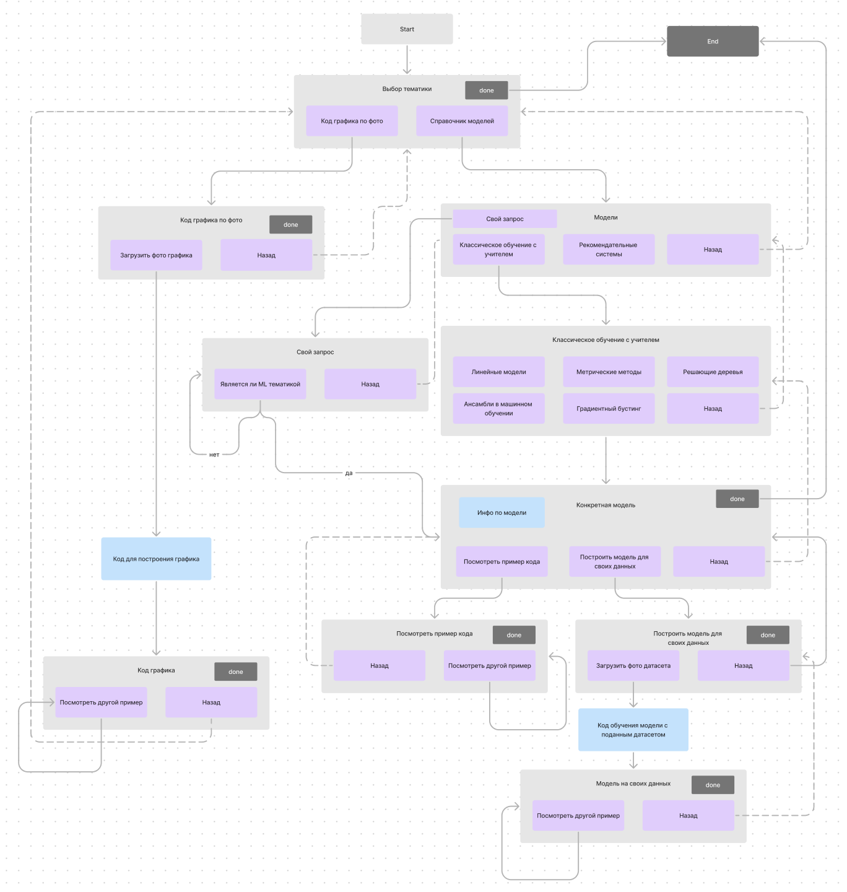

# Предисловие

Repo template: https://github.com/dimadem/telegram_chatbot_w_media_boilerplate

Дерево нашего бота:




Библиотеки:

- [openai](https://pypi.org/project/openai/)
- [python-telegram-bot](https://pypi.org/project/python-telegram-bot/)
- [Jupyter Notebook](https://pypi.org/project/notebook/)

## Структура проекта

```
telegram_chatbot_boilerplate/
│
├── config/
│   ├─── openai_client.py
│   ├─── telegram_bot.py
│   └─── tokens.py
│
├── handlers/
│   ├── __init__.py
│   ├── command_handlers.py
│   └── message_handlers.py
│
├── utils/
│   ├── __init__.py
│   └── helpers.py
│
├── app.py
├── Dockerfile
├── Makefile
└── requirements.txt
```

- `config/` - конфигурационные файлы
- `handlers/` - обработчики сообщений и команд
- `utils/` - вспомогательные функции
- `app.py` - главный файл приложения
- `Dockerfile` - скрипт для создания Docker образа
- `Makefile` - автоматизация процесса сборки
- `requirements.txt` - зависимости проекта

---
# Часть 0: Создание репозитория

- нажми кнопку справа сверху **USE THIS TEMPLATE**
- назови проект
- контент в репозитории будет использоваться для хакатона

---
  
# Часть 1: Локальная установка

Для локальной установки проекта потребуется:

- подключение к VPN серверу для доступа к API OpenAI
- токен Telegram бота
- токен API OpenAI
- операционная система Linux или MacOS

## Токен Телеграм бота

Для начала нужно получить токен для доступа к HTTP API вашего бота:

1. Найдите в Telegram бота `@BotFather`
2. Отправьте ему команду `/newbot`
3. Введите имя проекта и имя бота
4. Скопируйте полученный токен

## Установка проекта
0. Склонировать репозиторий
   ```
   git clone github.com/yourreponame
   ```
2. В `Makefile` введите токены Telegram и OpenAI:
   ```
   TELEGRAM_BOT_TOKEN=1235
   OPENAI_API_KEY=1234
   ```
3. Установка зависимостей, генерация файла `.env`:
   ```
   make setup
   ```

## Запуск проекта

1. Запускаем бота локально
   ```
   make run
   ```
2. Открываем Telegram бота и отправляем сообщение

   > Сообщения в Telegram боте и в терминале дублируются.

3. Для удаления .venv, .env, cache и других временных файлов:
   ```
   make clean
   ```

---

# Часть 2: Разработка на облачном сервере

Для удаленной разработки потребуется:

- Доступ к Серверу (ssh user@ip & password)
- Jupyter Notebook
- Visual Studio Code

#### Предустановленный софт на сервере:
- vim
- build-essential
- python3
- python3-venv
- docker-ce
- docker-ce-cli
- docker-buildx-plugin
- docker-compose-plugin

# Удаленная разработка
0. Заходим на сервер
  ```
  ssh -i PATH_TO_YOUR_KEY.pem admin@SERVER_IP_ADDRESS
  ```

1. Клонируем (по https) свой репозиторий в отдельную папку на сервер
   ```
   git clone <repositorylink>
   ```

3. В `Makefile` введите токены Telegram и OpenAI:
   ```
   TELEGRAM_BOT_TOKEN=1235
   OPENAI_API_KEY=1234
   ```
4. Установка зависимостей, генерация файла `.env`:
   ```
   make setup
   ```
5. Запускаем Jupyter Notebook
   ```
   make notebook
   ```
6. Копируем после **token=** в заметки:
   ```
   http://127.0.0.1:8888/tree?token=YOUR_PERSONAL_TOKEN
   ```
7. На своем **персональном устройстве** создаем туннель:
   ```
   ssh -NL 8888:localhost:8888 root@SERVER_IP_ADDRESS
   ```

   или (в зависимости от того, как вы залогинены на сервере)

   ```
   ssh -NL 8888:localhost:8888 admin@SERVER_IP_ADDRESS
   ```
  также если вы залогинены на сервере с использованием ключа (-i PATH_TO_YOUR_KEY.pem), его нужно указать при создании тунеля
   
9. Открываем в браузере;
   ```
   http://localhost:8888
   ```
10. Вставляем токен, который скопировали на шаге **5**, в поле "Password or token" и нажимаем Login.
11. Пользуемся

---

# Запуск Docker контейнера

Для деплоя контейнера на облачный сервер потребуется:

- Скаченная программа [Docker](https://www.docker.com/products/docker-desktop/)
- Аккаунт в [DockerHub](https://hub.docker.com/)
- [Создать репозиторий](https://docs.docker.com/docker-hub/repos/create/)
- токен Telegram бота
- токен API OpenAI
- операционная система Linux или MacOS

1. В `Makefile` добавим к уже имеющимся токенам, **username** и **repositoryname**:

   ```
   # данные пользователя на Docker Hub
   USERNAME=UserNameDockerHub
   REPO=RepositoryNameDockerHub
   TAG=v1
   TELEGRAM_BOT_TOKEN=1235
   OPENAI_API_KEY=1234
   ```
#### Для публикации образа в [DockerHub](https://hub.docker.com/) нужно залогиниться через CLI командой `docker login`


2. Собираем образ под Linux Debian:

   ```
   make build
   ```

3. Запускаем контейнер с приложением

  ```
   make dockerrun
  ```

4. Также, можно опубликовать образ в DockerHub:

   ```
   make push
   ```

---

## Скачивание и запуск опубоикованного образа

1. Находим опубликованный образ в DockerHub:

   ```
   docker search username/projectname
   ```

2. Скачиваем образ:

   ```
   docker pull username/projectname:v1
   ```

3. Запускаем контейнер с токенами Telegram бота и OpenAI API:

   ```
   sudo docker run -i -t -e TELEGRAM_BOT_TOKEN=YOURTOKEN -e OPENAI_API_KEY=YOURTOKEN username/projectname:v1
   ```

4. Открываем Telegram бота и отправляем сообщение
   > Сообщения в Telegram боте и в терминале дублируются.
